# Copilot Everywhere lab fallback walkthrough

Use these captures only when live tooling is unavailable or an exercise reaches
its timebox. Show the relevant frame, then keep the participant in the review
role: ask what the evidence proves, what it does not prove, and what decision
their persona owns.

## Engineer

### 1. API reproduction

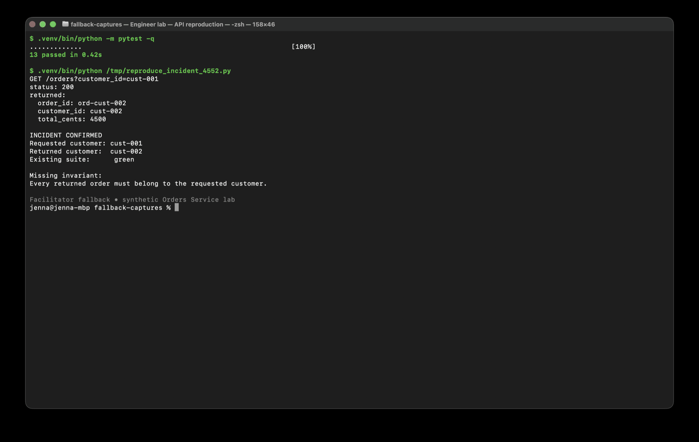

Use during Exercise 1 if the reproduction session cannot run. Ask participants
to identify why thirteen passing tests do not contradict the incident.

### 2. Bounded blast radius

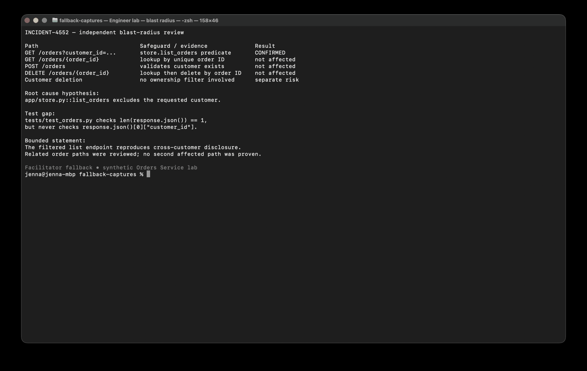

Use after the second investigation timebox. Require a distinction between the
confirmed filtered-list defect and related paths that were reviewed but not
proven affected.

### 3. Red ownership test

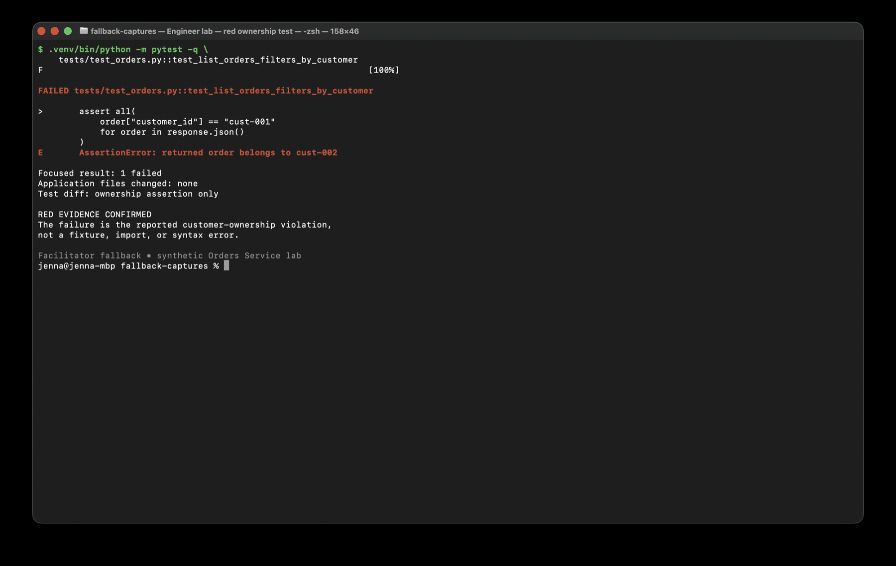

Use in Exercise 2 before authorizing a production change. Participants should
confirm the assertion fails on the returned owner rather than on setup noise.

### 4. Green verification

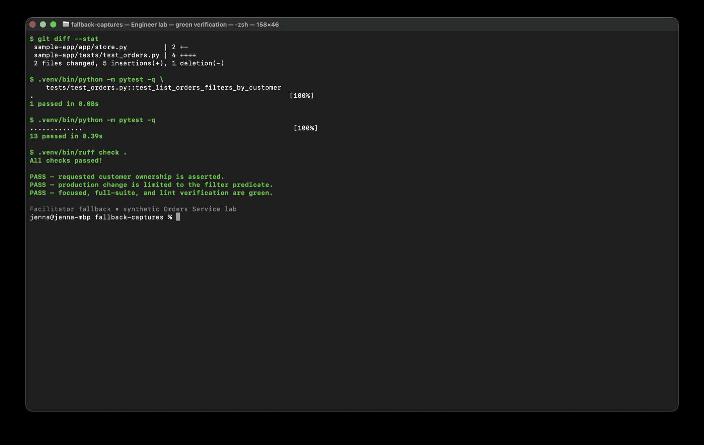

Use after the fix timebox. Ask whether the changed files and verification
commands are sufficient for the compact reviewer handoff.

## Platform

### 1. Unconfigured assumptions

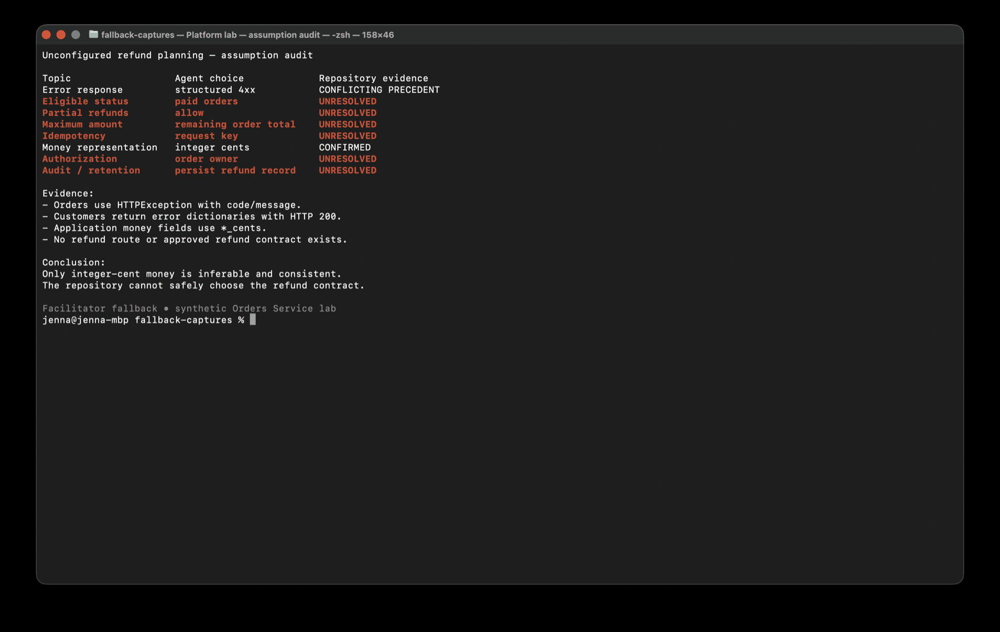

Use in Exercise 1 when a normal planning session is unavailable. Participants
must separate durable repository evidence from conflicting precedent and
missing policy.

### 2. Custom-agent boundary checks

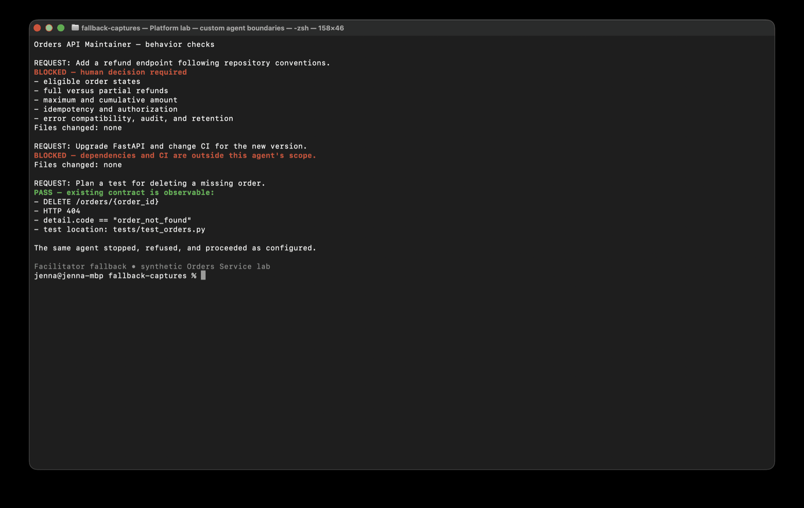

Use in Exercise 3. Review all three paths: missing decision, prohibited scope,
and allowed work. A stop is successful when it is caused by an explicit
boundary.

### 3. Path-scoped instruction activation

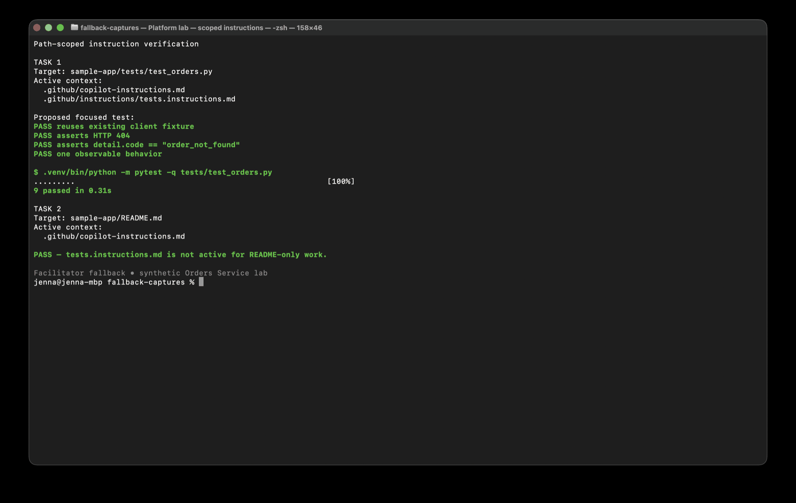

Use in Exercise 4. Ask participants to prove both sides of scope: the test file
loads the scoped instructions, while the README-only task does not.

## Product

### 1. Evidence-grounded demand map

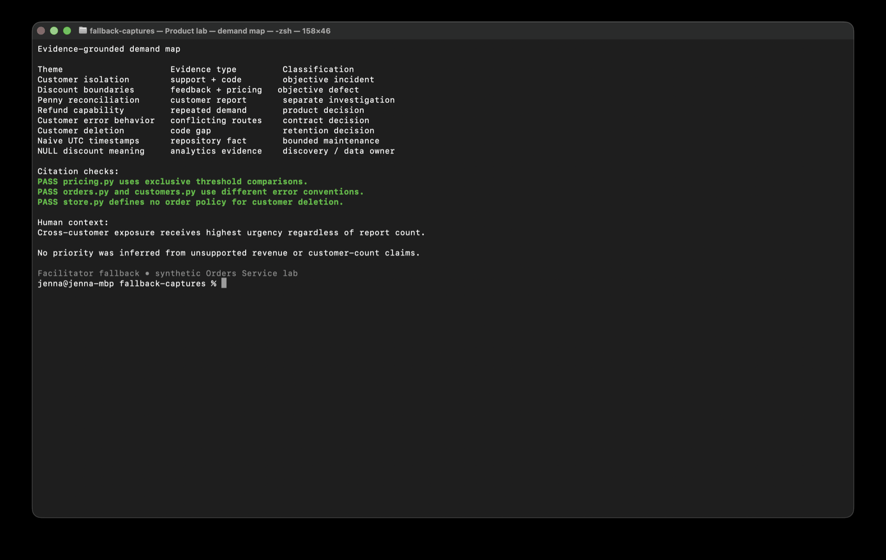

Use in Exercises 1–2. Participants should verify citations, keep the penny
complaint separate from exact boundaries, and identify the human-supplied
priority judgment.

### 2. Acceptance matrix

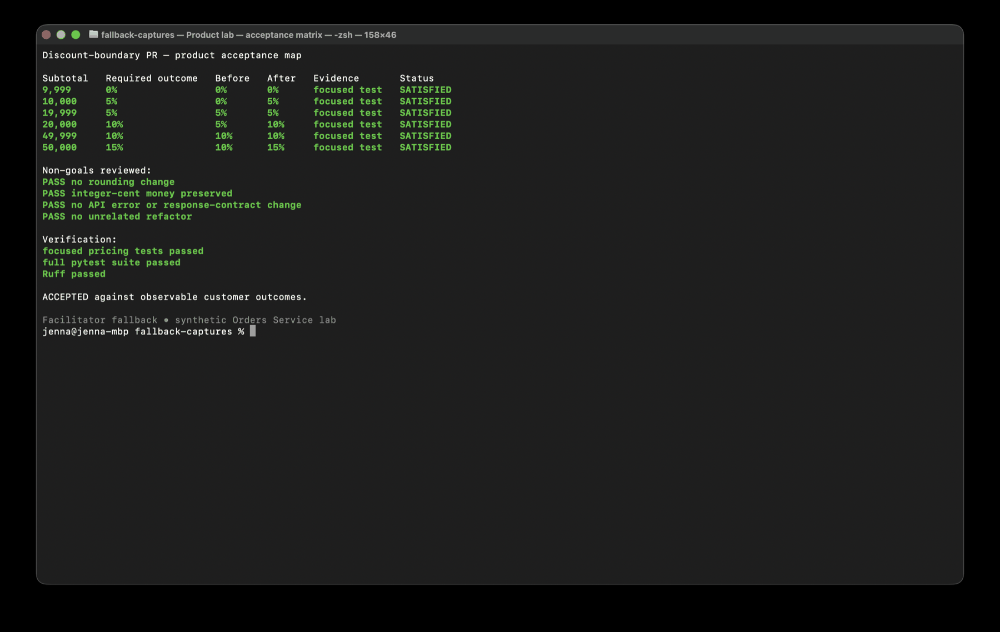

Use in Exercise 5 with the prepared fallback pull request. Product acceptance
rests on the six observable outcomes and protected non-goals, not on the
agent's summary or Python style.

## Data

### 1. Reconciliation baseline

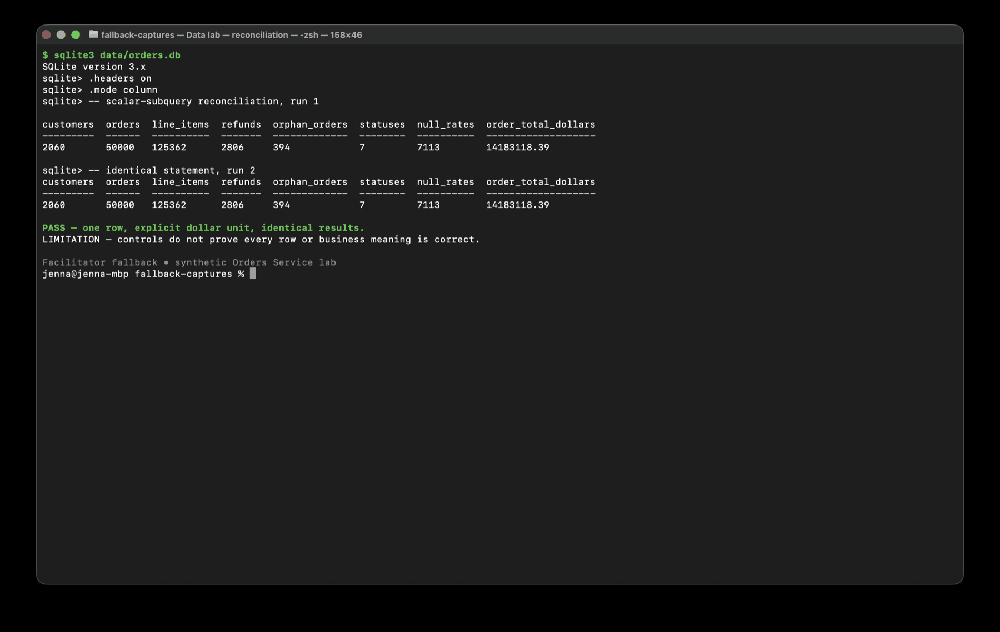

Use in Exercise 3. Ask why the order-dollar total is computed directly from
`orders` and what the controls still cannot prove.

### 2. Before and after query plans

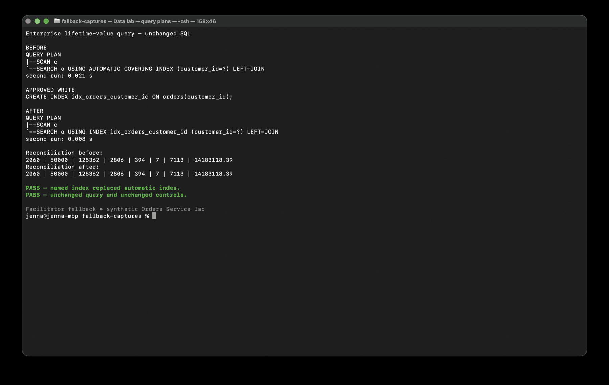

Use in Exercise 4. Require the unchanged query, named plan change, and
unchanged reconciliation; do not require a fixed timing improvement.

### 3. Semantic stop memo

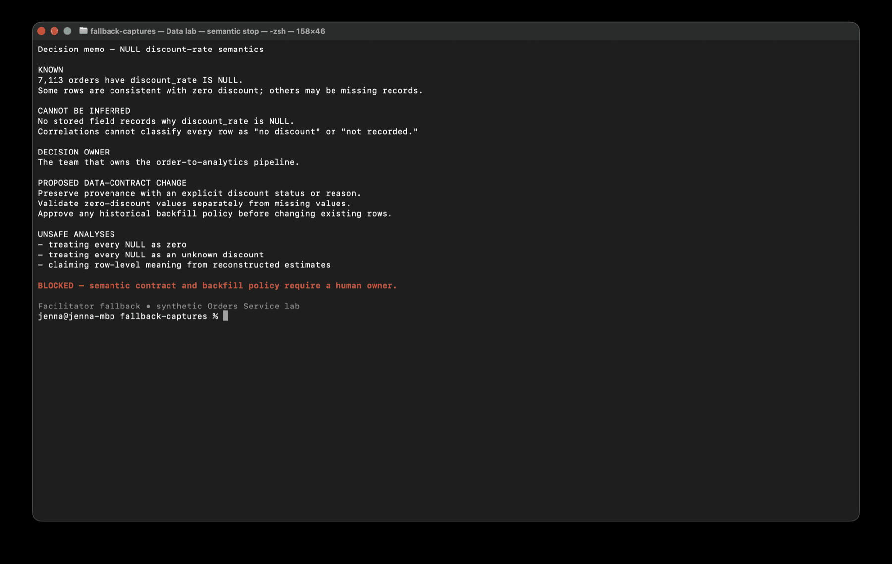

Use in Exercise 5. Participants should identify the missing provenance, name
the pipeline owner, and reject any row-level classification that the stored
data cannot support.
