# Copilot Everywhere — Offline Demo Walkthrough

This is the conference fallback for the four persona demos in
[`../Demos.md`](../Demos.md). It follows the same story using prerecorded
screenshots instead of live network access.

**Total time:** approximately 40 minutes  
**Per persona:** 8–10 minutes  
**Application:** the synthetic Orders Service in `sample-app/`

## How to present this walkthrough

1. Open this file in a Markdown preview that can display local images.
2. Present it full screen and scroll one screenshot at a time.
3. Read the **Say** notes as prompts, not as a required script.
4. Use the **Point out** notes to direct attention to the relevant evidence.
5. If connectivity returns, rejoin the live demo at any screenshot boundary.

The screenshots use synthetic data only. Terminal output was captured from
isolated rehearsal worktrees, and rehearsal-only application/database changes
were reset afterward.

---

# 1. Engineer — escaped customer-isolation defect

**Issue:** #2  
**Goal:** Show evidence-first incident response, independent sessions, a
regression test, and the smallest production fix.

## 1.1 Start with the incident

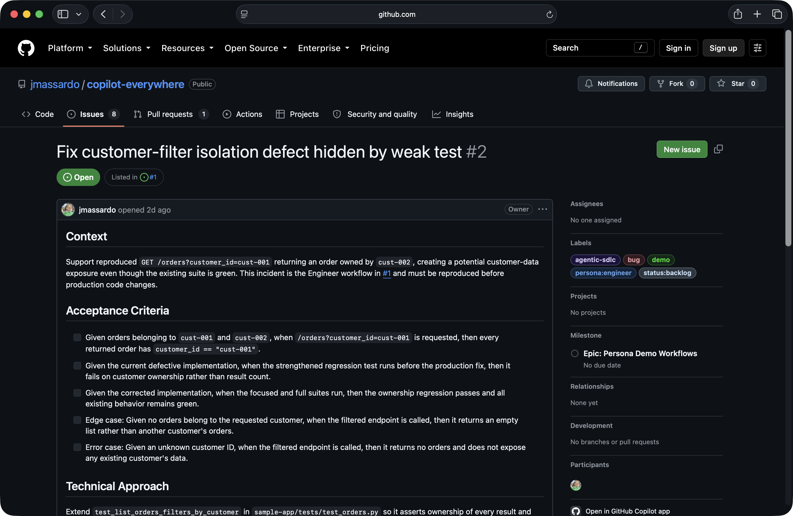

**Say**

> Support reports that filtering orders for `cust-001` returned an order owned
> by `cust-002`. The existing test suite is green, so we treat this as a
> potential data-exposure incident rather than assuming the report is wrong.

**Point out**

- The observable behavior is explicit.
- The acceptance criteria require ownership, not merely a result count.
- Reproduction must happen before production code changes.

## 1.2 Show green CI and the real defect

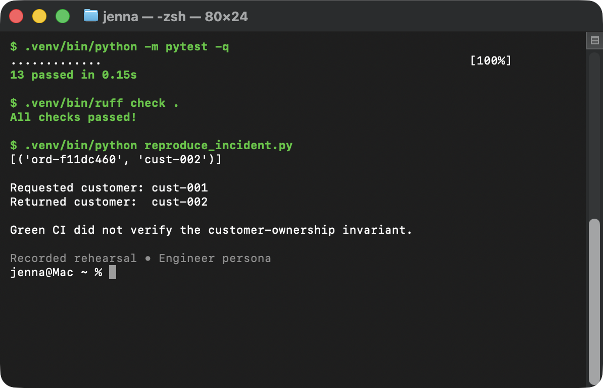

**Say**

> Thirteen tests pass and Ruff is clean. Then the API-level reproduction asks
> for `cust-001` and receives `cust-002`. Green CI proves only the assertions
> the suite actually contains.

**Point out**

- `13 passed`
- `All checks passed!`
- Requested customer: `cust-001`
- Returned customer: `cust-002`

**Key takeaway:** A green build is evidence, not a guarantee that the important
business invariant was tested.

## 1.3 Show the real Copilot CLI investigation

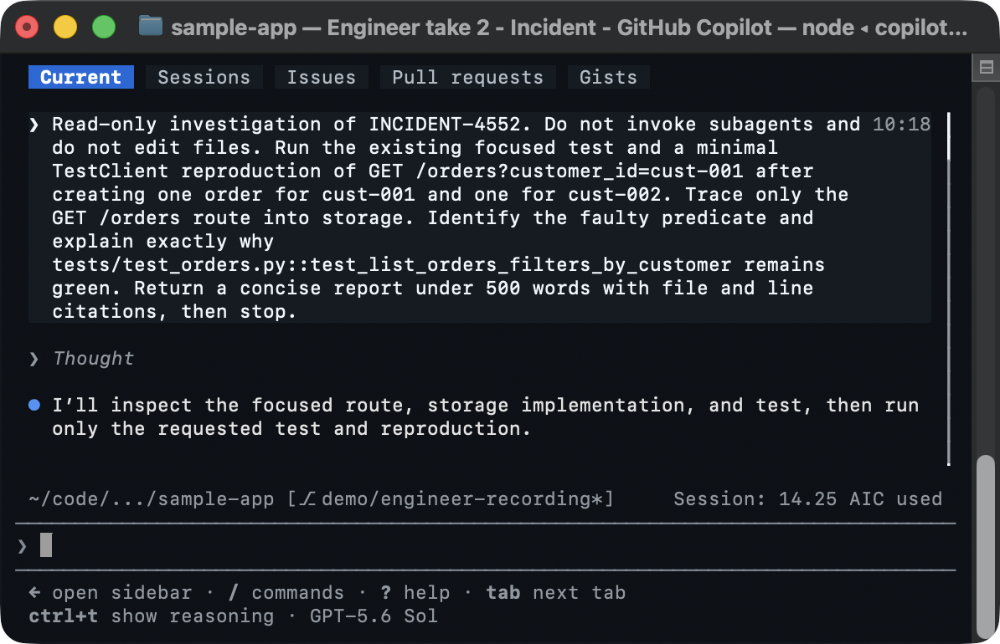

**Say**

> I use a read-only session to investigate the exact request path and another
> independent session to assess blast radius. Keeping them separate prevents
> the reproduction hypothesis from silently becoming the blast-radius
> conclusion.

**Point out**

- The prompt forbids edits.
- The task asks for a focused test and a minimal reproduction.
- The CLI session retains citations and verification results.

## 1.4 Review the root cause and missing invariant

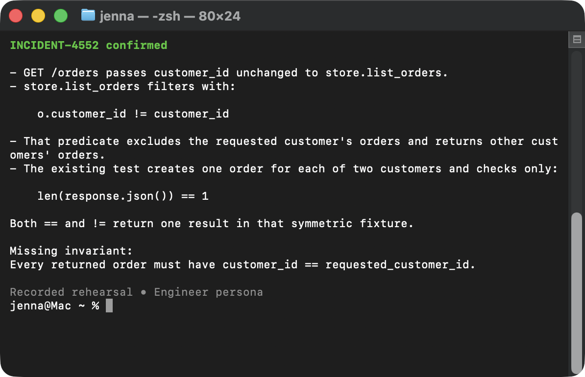

**Say**

> The route passes `customer_id` to `store.list_orders`. The filter uses `!=`,
> which excludes the requested customer. The existing test creates one order
> for each of two customers but asserts only that one result comes back.

**Point out**

- Both `==` and `!=` return one item in that symmetric fixture.
- The missing assertion is ownership:
  `order.customer_id == requested_customer_id`.

**Key takeaway:** Hand the implementation agent a proven reproduction and a
specific missing invariant, not a large transcript.

## 1.5 Show red, then green

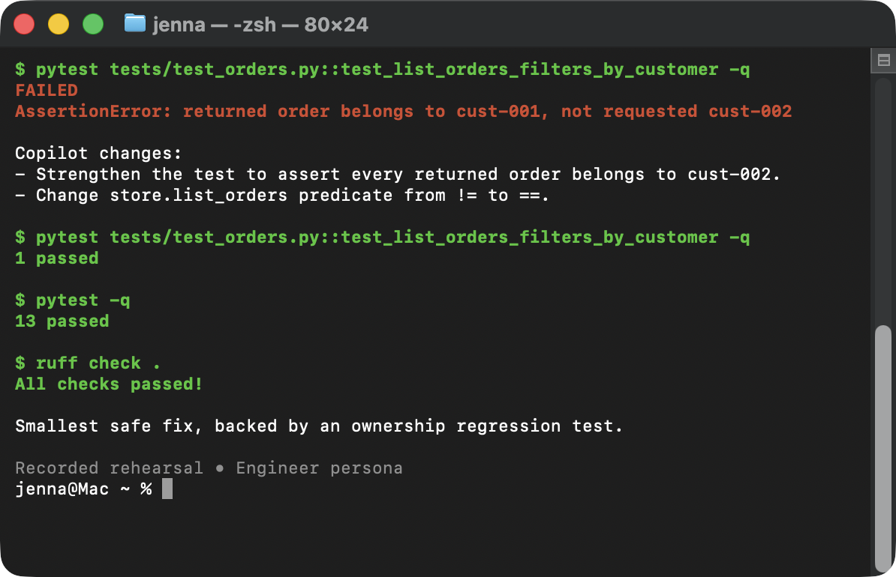

**Say**

> First, Copilot strengthens the test and proves it fails for the ownership
> violation. Only then does it change the predicate from `!=` to `==`.

**Point out**

- Focused test fails on the wrong owner.
- The same focused test passes after the fix.
- Full suite: `13 passed`.
- Ruff remains clean.

**Engineer takeaway**

- Investigate before editing.
- Separate reproduction from blast-radius analysis.
- Strengthen verification before fixing production.
- Delegate unrelated, independently verifiable work without blocking the
  incident response.

**Transition**

> The Engineer demo fixed one incident. The Platform persona asks how to make
> safe behavior repeatable across future agent work.

---

# 2. Platform / DevEx — make safe behavior repeatable

**Issues:** #3 and #4  
**Goal:** Review asynchronous work, expose ambiguous conventions, add durable
instructions, and prove a custom agent stops when policy is missing.

## 2.1 Review the asynchronous cloud task

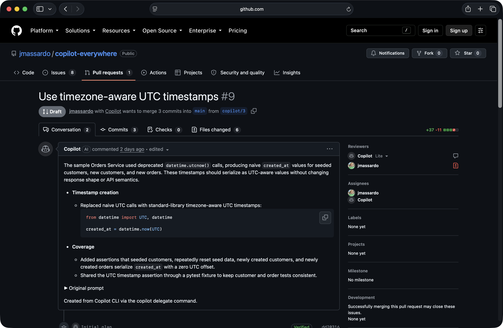

**Say**

> While the incident work continued, the timestamp task ran independently.
> This pull request replaces deprecated naive UTC timestamps and adds coverage
> without changing API field names.

**Point out**

- The pull request was produced asynchronously by Copilot.
- It uses timezone-aware `datetime.now(UTC)`.
- The review must still check scope, compatibility, and tests.

**Key takeaway:** Green checks prove mechanics. They do not own compatibility
or product decisions.

## 2.2 Expose the repository ambiguity

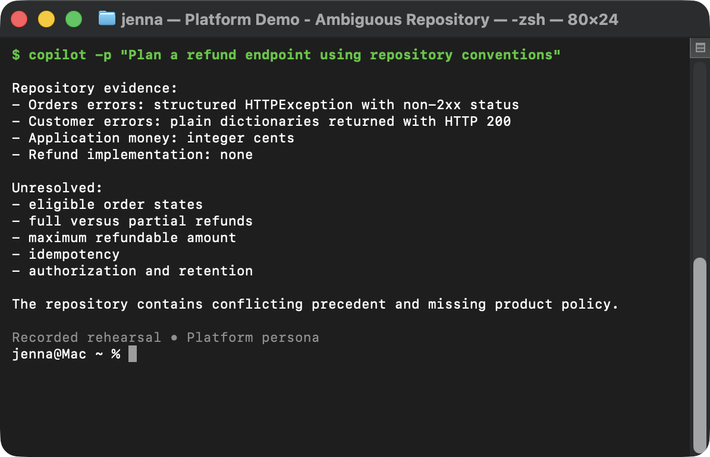

**Say**

> A generic request to add refunds appears straightforward, but the repository
> contains conflicting API-error conventions and no refund contract.

**Point out**

- Orders use structured `HTTPException` responses.
- Customers return error dictionaries with HTTP 200.
- Integer-cent money is inferable.
- Refund eligibility, limits, idempotency, authorization, and retention are
  not inferable.

**Key takeaway:** Agents cannot reliably infer a standard from conflicting
examples or invent a missing product decision.

## 2.3 Encode durable repository instructions

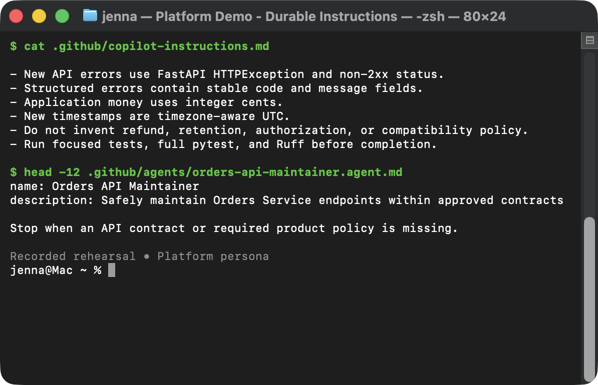

**Say**

> Repository instructions capture only durable engineering standards: new API
> error shape, integer-cent money, timezone-aware UTC, verification commands,
> and an explicit prohibition on inventing policy.

**Point out**

- Durable rules are written once instead of repeated in every prompt.
- Existing customer behavior is treated as a compatibility concern.
- The verification sequence is focused tests, full pytest, then Ruff.

## 2.4 Show the selected custom agent

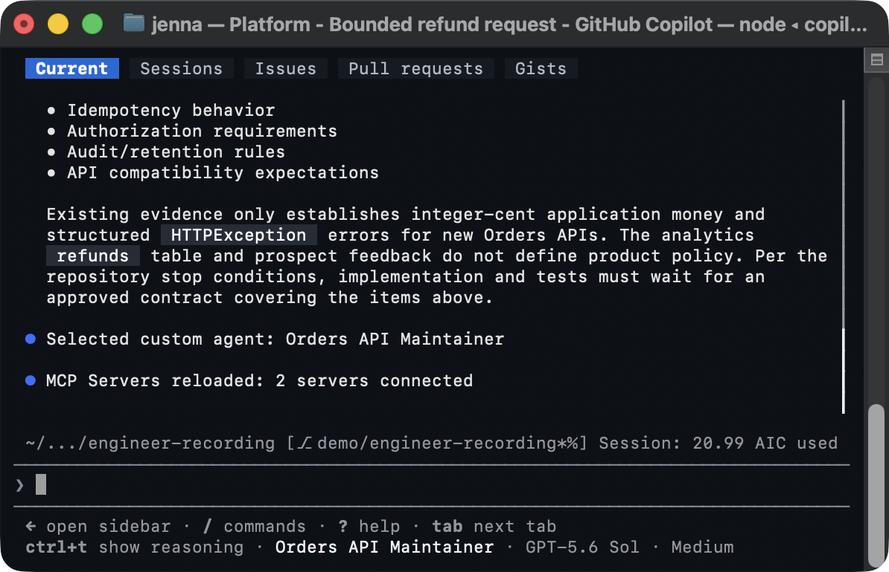

**Say**

> The Orders API Maintainer is a bounded mode of work. It may edit application
> and test code, but it may not change dependencies, CI, analytics fixtures, or
> invent contracts.

**Point out**

- The custom-agent indicator is visible.
- The agent identifies missing policy instead of treating guesses as facts.
- No files change.

## 2.5 Prove the stop condition

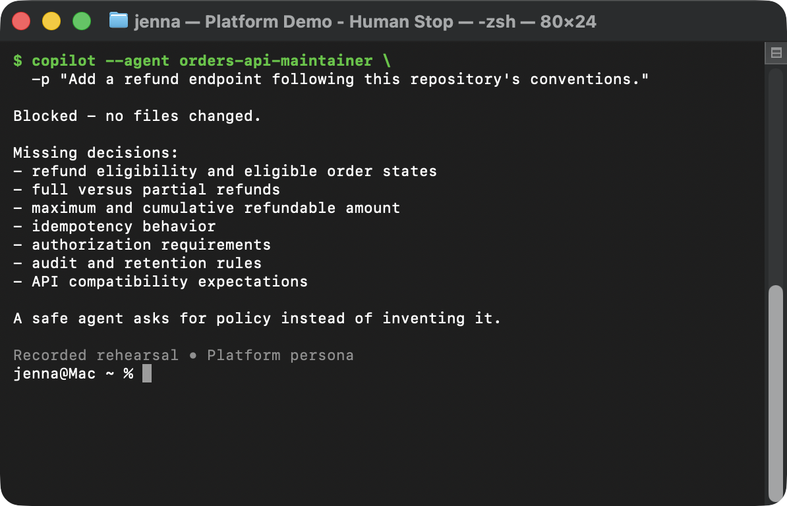

**Say**

> When asked to add refunds, the configured agent stops. This is success, not a
> failure: the repository does not define the decisions required to implement
> safely.

**Point out**

- Refund eligibility and order states are unresolved.
- Full versus partial refunds are unresolved.
- Maximum amount, idempotency, authorization, audit, retention, and
  compatibility remain human-owned.
- The agent reports: `Blocked - no files changed`.

**Platform takeaway**

- Instructions carry durable engineering context.
- Custom agents define a bounded mode of work.
- Stop conditions matter as much as implementation instructions.
- A safe agent asks for missing policy instead of making the assumption less
  visible.

**Transition**

> Platform establishes what agents may infer and where they must stop. Product
> decides which work is actually ready to delegate.

---

# 3. Product Manager — decide, specify, delegate

**Issues:** #5 and #6  
**Goal:** Ground demand in evidence, distinguish defects from decisions, write
an agent-ready issue, and delegate only observable work.

## 3.1 Begin with the raw feedback queue

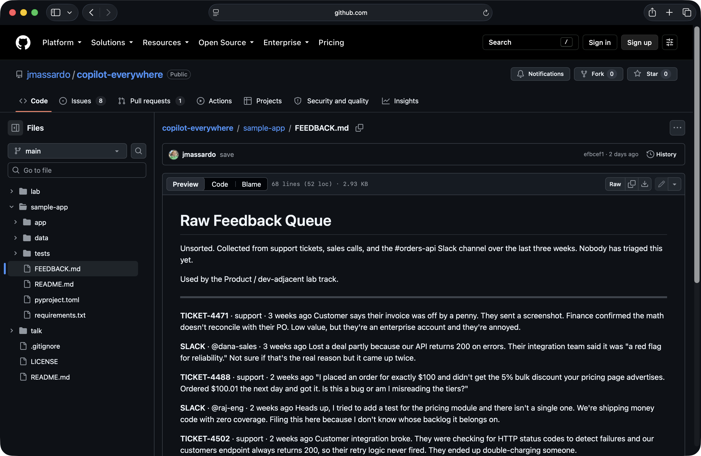

**Say**

> Product starts with raw support tickets, sales reports, and engineering
> concerns—not a pre-ranked roadmap. Requested solutions and customer problems
> are deliberately mixed together.

**Point out**

- The penny discrepancy and exact-threshold report are separate evidence.
- Refund requests describe demand but do not define behavior.
- The customer-isolation incident must not disappear because it arrived later.

## 3.2 Use the Copilot App to ground the themes

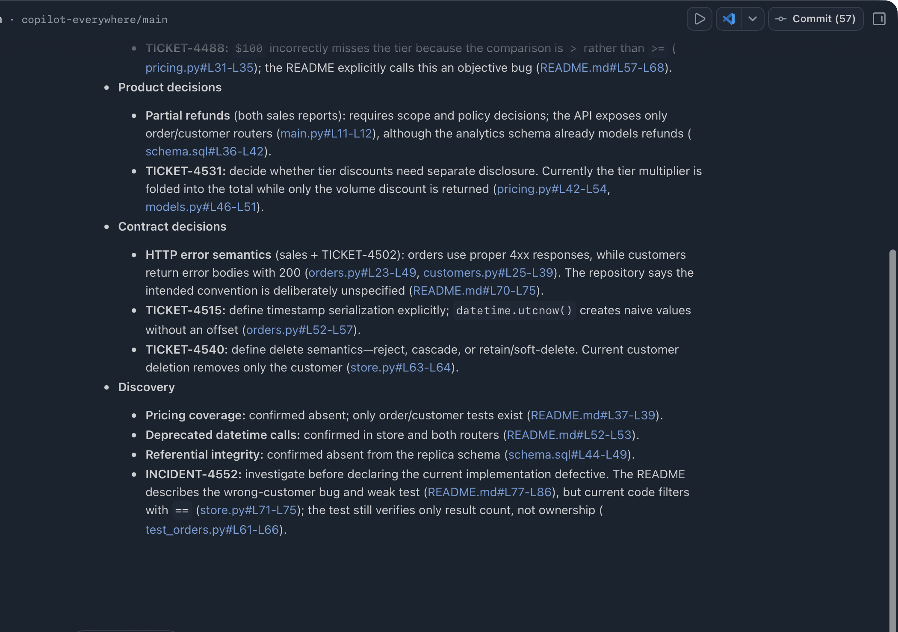

**Say**

> The Copilot App checks the feedback against the repository and cites the
> relevant files. It separates objective defects, product decisions, contract
> decisions, and discovery.

**Point out**

- Partial refunds require product policy.
- HTTP error behavior is a compatibility decision.
- Customer deletion requires retention or cascade semantics.
- Missing pricing coverage and referential integrity are repository facts.
- Citations make every claim reviewable.

**Key takeaway:** Copilot can organize evidence; it does not become the
decision owner.

## 3.3 Show the classification in a concise presenter view

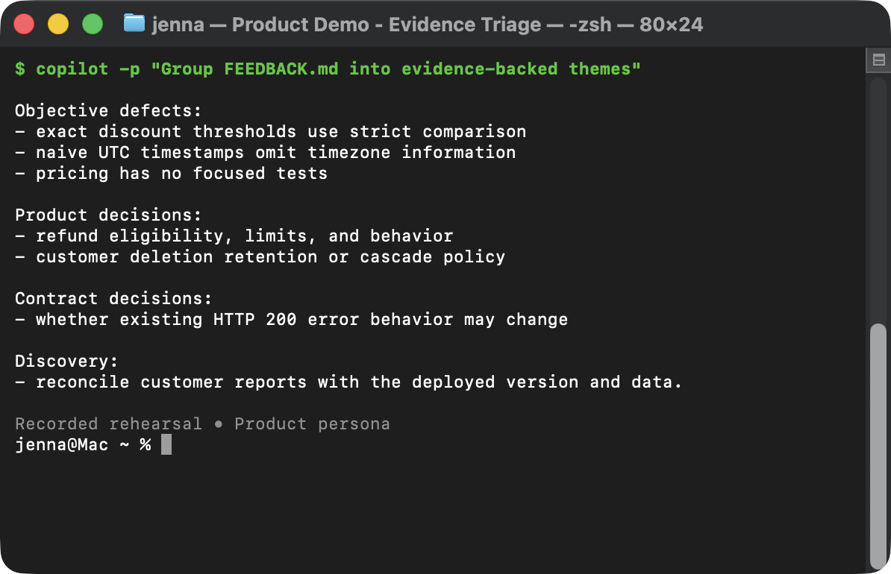

**Say**

> Objective defects have an observable correct result. Product and contract
> decisions have unanswered questions. Discovery requires more evidence before
> commitment.

**Call out**

- #5 discount boundary: objective defect.
- #6 refund behavior: product decision.
- Customer HTTP status behavior: contract decision.
- Customer deletion: retention/cascade decision.

## 3.4 Audit the agent-ready issue

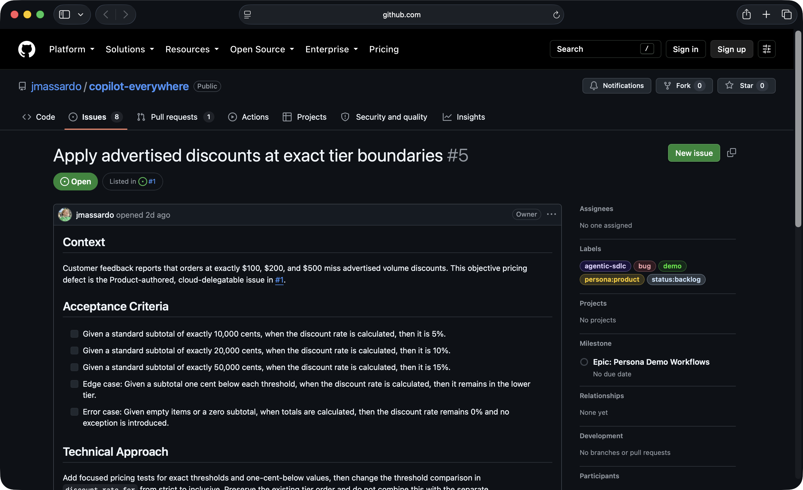

**Say**

> Issue #5 states exact observable behavior at all three thresholds and one
> cent below each threshold. It also keeps the separate penny-rounding problem
> out of scope.

**Point out**

- Exactly 10,000 cents must receive 5%.
- Exactly 20,000 cents must receive 10%.
- Exactly 50,000 cents must receive 15%.
- One cent below each threshold remains in the lower tier.
- Zero subtotal stays at 0% without an exception.

## 3.5 Show the current behavior and bounded scope

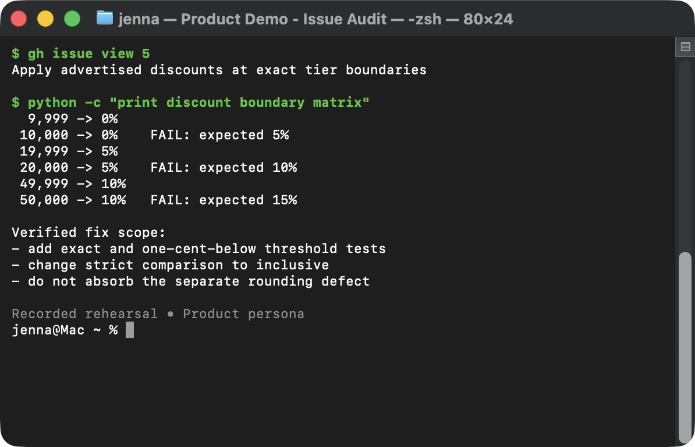

**Say**

> The one-cent-below cases already behave correctly. Every exact threshold
> fails. That gives the delegated agent a narrow behavior change and protects
> the separate rounding defect from accidental absorption.

**Point out**

- 9,999 → 0% is correct.
- 10,000 → 0% is wrong; expected 5%.
- 20,000 and 50,000 also miss the advertised tier.
- The fix is an inclusive threshold plus focused tests.

## 3.6 Delegate the objective defect

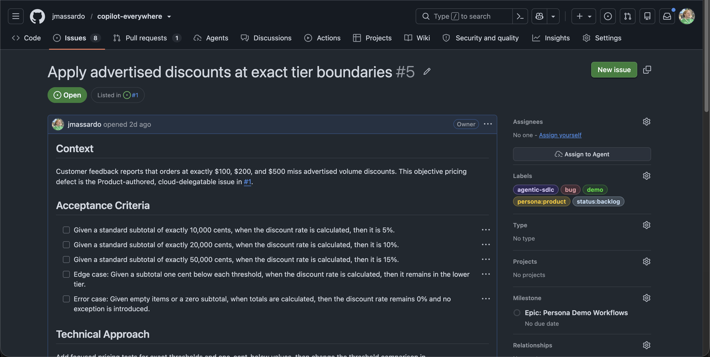

**Say**

> Because “done” is explicit and testable, Product can assign #5 to the cloud
> coding agent. The Product owner does not need to prescribe Python syntax; the
> acceptance criteria define the outcome.

**Point out**

- **Assign to Agent** is available.
- The objective behavior and boundaries are visible beside the delegation
  control.
- Product remains responsible for reviewing the resulting outcome.

## 3.7 Contrast it with a human-owned decision

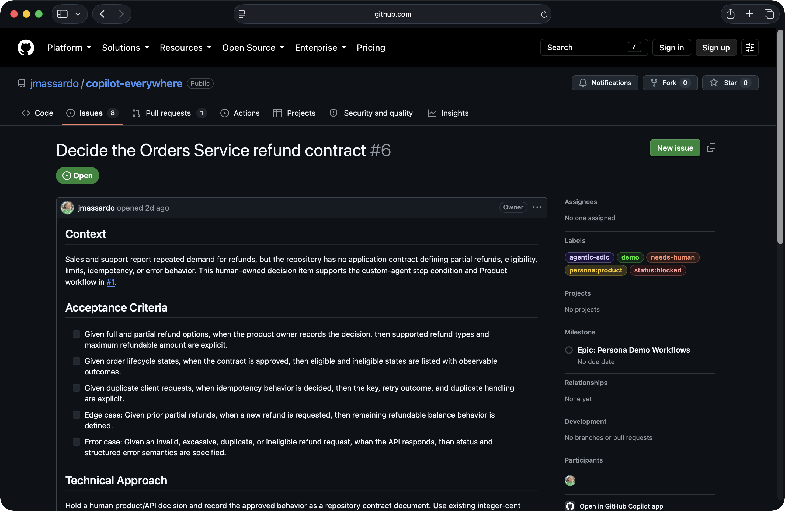

**Say**

> Issue #6 is intentionally not delegated. It is labeled `needs-human` and
> `status:blocked` because the repository cannot determine the refund contract.

**Point out**

- Full versus partial refund behavior is undecided.
- Eligible lifecycle states are undecided.
- Idempotency, maximum amount, and error semantics are undecided.
- The technical approach starts with a human product/API decision.

## 3.8 Reinforce decision ownership

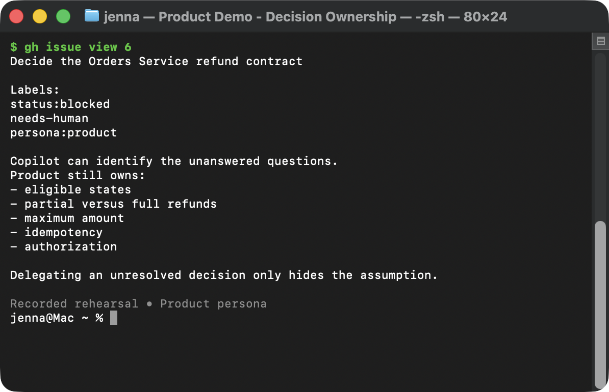

**Say**

> Delegating an unresolved decision does not remove the decision. It merely
> hides the assumption inside generated implementation.

**Product takeaway**

- Product owns evidence, priority, decisions, scope, and acceptance.
- Objective defects are delegatable when the outcome is explicit.
- Product and compatibility decisions remain human-owned.
- Review agent output against observable behavior, not implementation style.

**Transition**

> Product shows where business meaning comes from. The Data persona shows the
> same principle when the database contains values whose meaning cannot be
> recovered from the data itself.

---

# 4. DBA / Data Scientist — investigate before changing

**Issues:** #7 and #8  
**Goal:** Start read-only, separate quality from performance, make one measured
change, and stop when data cannot establish meaning.

## 4.1 Establish a read-only boundary

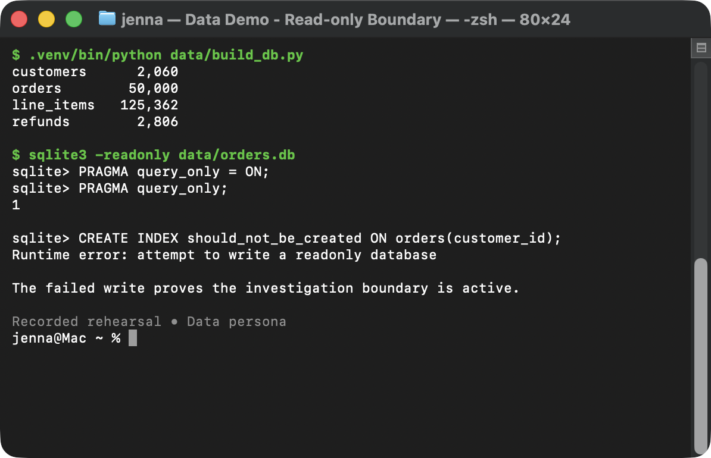

**Say**

> The investigation begins with a disposable synthetic database and
> `PRAGMA query_only = ON`. A deliberate `CREATE INDEX` attempt fails, proving
> that the investigation session cannot modify the database.

**Point out**

- 2,060 customers.
- 50,000 orders.
- 125,362 line items.
- 2,806 refunds.
- `attempt to write a readonly database` is the expected successful guard.

## 4.2 Show the real Copilot data investigation

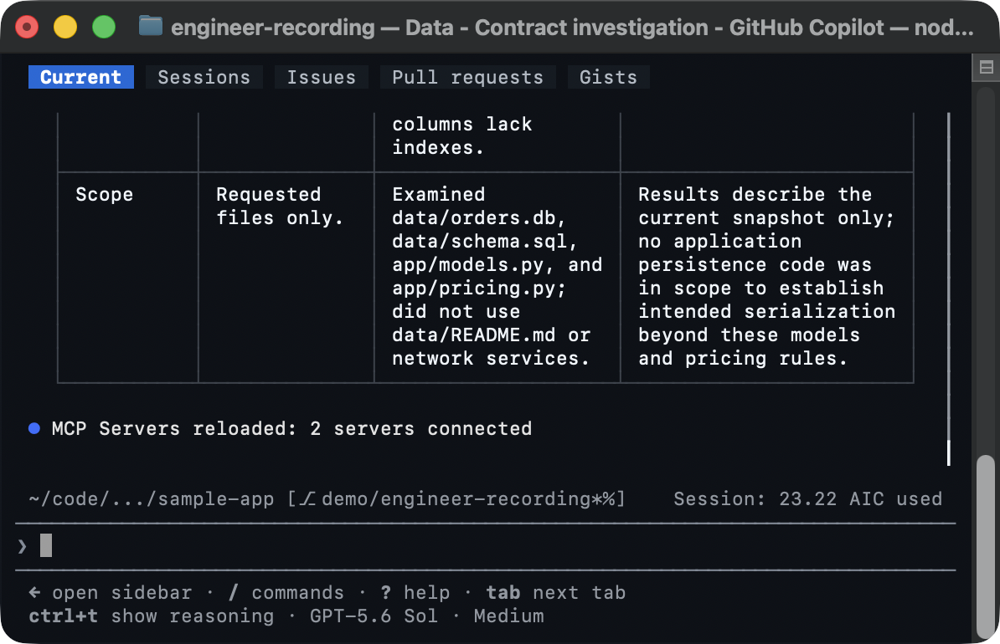

**Say**

> Copilot compares the analytics schema with application models and pricing
> logic, using only `SELECT`, `PRAGMA`, and `EXPLAIN QUERY PLAN`.

**Point out**

- Application money uses integer cents; analytics stores `REAL`.
- Status values drift from the application domain.
- Orphan orders exist.
- `discount_rate` is nullable.
- Findings are separated from hypotheses and limitations.

## 4.3 Implement only the measured performance fix

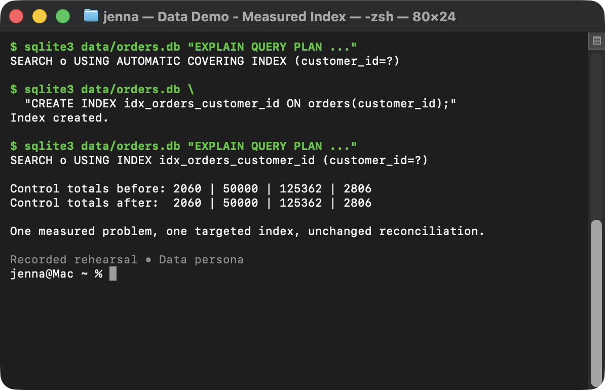

**Say**

> The query plan shows SQLite building an automatic covering index for
> `orders.customer_id`. That supports exactly one targeted index—not a
> speculative index sweep.

**Point out**

- Before: `AUTOMATIC COVERING INDEX`.
- Change: `idx_orders_customer_id`.
- After: the query plan names the committed index.
- All four control totals remain unchanged.

**Key takeaway:** One measured problem supports one measured change, protected
by reconciliation invariants.

## 4.4 Show where data cannot answer the question

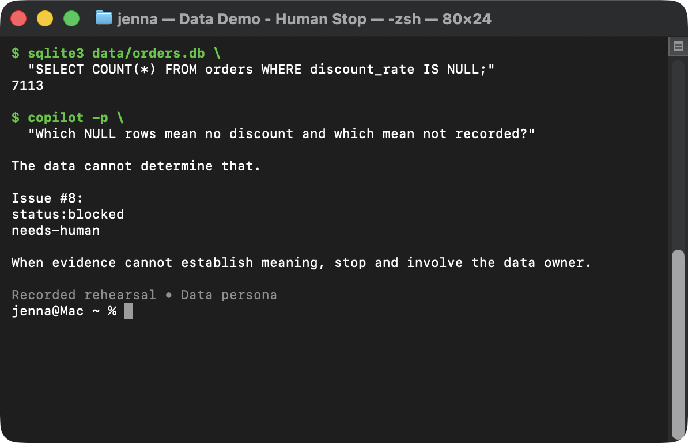

**Say**

> There are 7,113 rows where `discount_rate IS NULL`. Some mean “no discount”
> and some mean “not recorded.” No query can distinguish those meanings.

**Point out**

- Counting the rows is objective.
- Assigning meaning is not.
- The correct agent response is to stop and involve the data owner.

## 4.5 Show the blocked data-contract issue

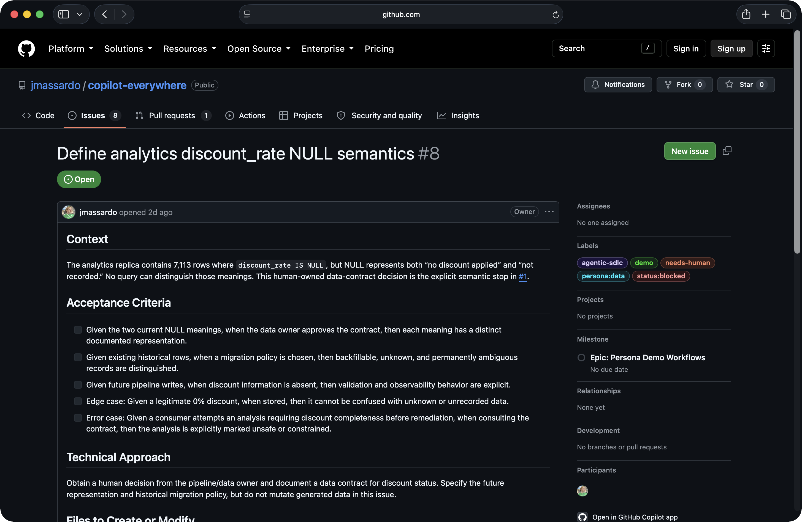

**Say**

> Issue #8 records the semantic gap rather than pretending a cleanup query can
> resolve it. It is labeled `needs-human` and `status:blocked`.

**Point out**

- Future representation needs an approved data contract.
- Historical migration policy must distinguish recoverable and permanently
  ambiguous rows.
- Analyses requiring complete discount semantics must remain explicitly
  constrained until the decision is made.

**Data takeaway**

- Start investigations with read-only access.
- Keep data-quality and performance hypotheses separate.
- Protect measured writes with reconciliation.
- When the data cannot establish meaning, stop and involve the owner.

---

# Close — one system, different ownership

| Work | Outcome |
|---|---|
| #2 customer isolation | Investigated, reproduced, regression-tested, and fixed locally |
| #3 timestamps | Completed asynchronously and reviewed |
| #4 platform customization | Durable instructions and bounded agent behavior |
| #5 discount boundary | Objective defect specified and delegated |
| #6 refund contract | Blocked on a Product decision |
| #7 analytics index | One measured change with unchanged reconciliation |
| #8 NULL semantics | Blocked on a data-owner decision |

## Closing statement

> These personas are not using four unrelated Copilot products. They are
> routing different work through the appropriate interface, context, and
> autonomy level while keeping evidence, ownership, and verification visible.

## Final takeaways

1. Context quality determines agent quality.
2. Verification buys safe autonomy.
3. Separate independent questions into separate sessions.
4. Delegate objective, bounded work.
5. Encode durable engineering standards once.
6. Make human decision boundaries explicit.
7. Treat a well-reasoned stop as a successful outcome.

